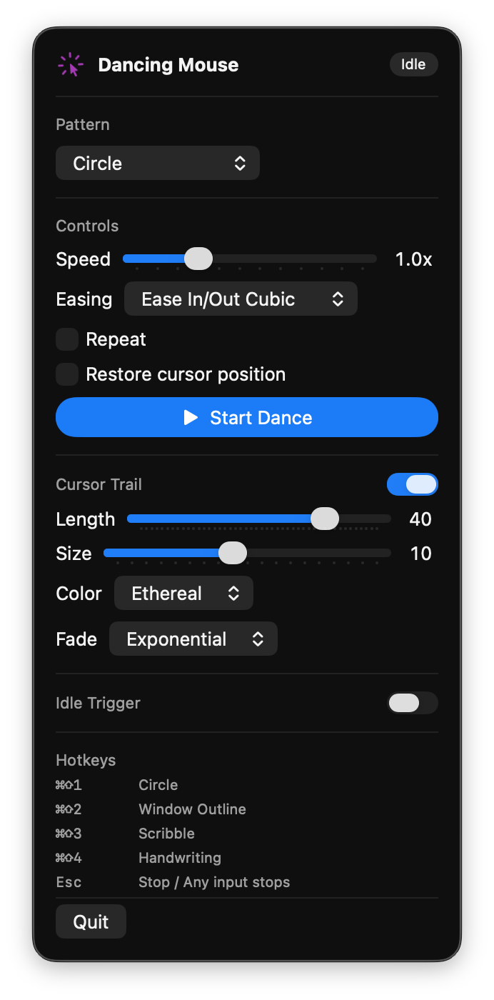

<p align="center">
  
</p>

<h1 align="center">Dancing Mouse</h1>

<p align="center">A tiny macOS menu-bar app that makes your cursor dance.</p>

<p align="center">
  
</p>

---

Pick a pattern, hit play, and watch your pointer trace it across the screen. Touch the mouse or keyboard and it stops instantly — you're always in control.

## Install

### Homebrew

```bash
brew tap dirtyditto/dancing-mouse https://github.com/dirtyditto/Dancing_Mouse
brew install --cask dancing-mouse
```

### Direct download

Grab the latest `.dmg` from the [Releases page](https://github.com/dirtyditto/Dancing_Mouse/releases), open it, and drag **Dancing Mouse** to `/Applications`.

### From source

```bash
git clone https://github.com/dirtyditto/Dancing_Mouse.git
cd Dancing_Mouse
make install
open "/Applications/Dancing Mouse.app"
```

On first launch macOS will ask for **Accessibility** permission — grant it in *System Settings → Privacy & Security → Accessibility*, then relaunch.

## Patterns

- **Circle**, **Figure-8**, **Spiral**, **Star** — classic shapes
- **Window Outline** — traces the rectangle of your frontmost window
- **Scribble** — a smooth, random doodle
- **Handwriting** — types out any string you give it

Add a glowing ghost trail, pick an easing curve, set the speed, or have it kick in automatically after a few seconds of stillness.

## Hotkeys

| Keys | Action |
| --- | --- |
| `⌘⇧1` | Circle |
| `⌘⇧2` | Window Outline |
| `⌘⇧3` | Scribble |
| `⌘⇧4` | Handwriting |
| `Esc` | Stop |

## Build

```bash
make app       # build .app into ./build
make run       # build + launch
make dmg       # build a distributable .dmg
make clean     # wipe build artifacts
```

Requires macOS 14+ and a Swift 5.9 toolchain (ships with Xcode 15).

## License

[MIT](./LICENSE).
